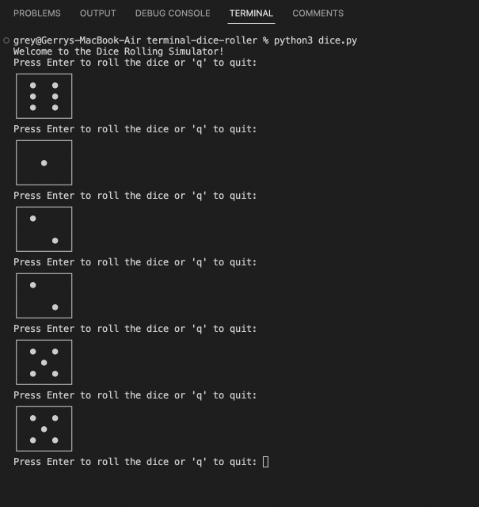

 # Dice Rolling Simulator

This is a simple dice rolling simulator written in Python. It allows the user to roll a six-sided die and see the result.

## How to use

To use the dice rolling simulator, simply run the `dice.py` file using python3. You will be prompted to press Enter to roll the dice or 'q' to quit.

If you press Enter, the program will roll the dice and display the result. The result will be displayed using ASCII art.

If you press 'q', the program will quit.

## Code

The code for the dice rolling simulator is relatively simple. The main function is as follows:

```python
def main():
    print("Welcome to the Dice Rolling Simulator!")

    while True:
        user_input = input("Press Enter to roll the dice or 'q' to quit: ").strip()
        
        if user_input == 'q':
            print("Goodbye!")
            break
        
        if user_input == '':
            die_value = roll_dice()
            display_dice(die_value)
        else:
            print("Invalid input. Press Enter to roll or 'q' to quit.")

if __name__ == "__main__":
    main()
```

The `roll_dice()` function simply generates a random number between 1 and 6. The `display_dice()` function then displays the ASCII art for the given die value.

The `while` loop allows the user to roll the dice multiple times. The loop will continue until the user enters 'q' to quit.

## Conclusion

This is a simple example of a dice rolling simulator written in Python. It is a good example of how to use Python to create a simple program with a graphical user interface.

## Example

